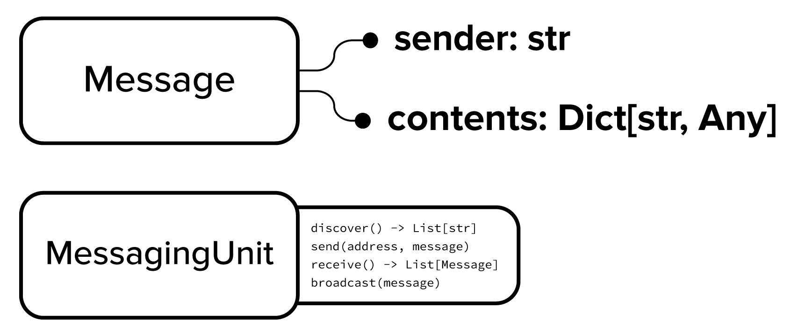

# Project Structure

## Overview

The design of the project is aimed at enabling the comparison of various intersection control algorithms across various
environments.

Examples of algorithms
include [Query-based centralised intersection control](https://www.aaai.org/Papers/JAIR/Vol31/JAIR-3117.pdf),
decentralised reinforcement learning
and [decentralised negotiation-based approaches](https://ieeexplore.ieee.org/document/6843706). Examples of environments
include [SUMO](https://www.eclipse.org/sumo/), [CARLA](https://carla.org/) or a scale-model road environment
like [Duckietown](https://www.duckietown.org/).

```{image} ../image/flowcharts/algo-env-relationship.png
:alt: Algorithm and Environment Interaction
:width: 400px
```

In order to achieve this, the project separates an intersection control experiment into two components: the algorithm,
and the environment: the algorithm determines the behaviour of the vehicles at each point in time, and interacts with
the environment to get the information (speed, position etc) necessary to determine that behaviour, before using the
environment to execute it.

The algorithm interacts with the environment through a uniform interface defined in
{mod}`intersection_control.core.environment`. This means that in theory, the same algorithm could be tested in a number
of different environments - this could, for example, provide insights into the algorithm's resilience and stability.

Similarly, the algorithms implement a uniform interface (all of their behaviour is determined by implementing a
{meth}`step() <intersection_control.core.vehicle.Vehicle.step>`
function), and so a number of algorithms could be run on the same environment in the same traffic conditions, and their
performance compared.

## Environment

The [Environment API](../api/environment.md) is defined in {mod}`intersection_control.core.environment` and consists of
three components:

```{image} ../image/flowcharts/environment.png
:alt: Environment API Structure
```

The main {class}`Environment <intersection_control.core.environment.Environment>` class is what any intersection control
algorithm will interact with, and will provide methods for retrieving general information about the environment, such as
the current time, any new vehicles which have arrived in the environment etc. It also provides a {meth}`step()
<intersection_control.core.environment.Environment.step>`
method, which should advance the state of the environment by a time step. In a simulated environment, this will consist
of advancing the simulation state, and in a physical environment this could consist of {func}`time.sleep()`-ing for a
few milliseconds.

Additionally, the {class}`Environment <intersection_control.core.environment.Environment>` class provides access to both
a {class}`VehicleHandler <intersection_control.core.environment.VehicleHandler>` and {class}`IntersectionHandler
<intersection_control.core.environment.IntersectionHandler>` object
(through its {attr}`intersections <intersection_control.core.environment.Environment.intersections>` and
{attr}`vehicles <intersection_control.core.environment.Environment.vehicles>`
properties) which provide more specialised behaviour for retrieving and modifying the state of vehicles and
intersections respectively.

### Implementing your own environment

Creating a new environment to test intersection control algorithms in would involve subclassing these three components
and providing their implementations. One such implementation which is provided by the library is
{class}`intersection_control.environments.SumoEnvironment`. Some more information about implementing your own
environment can be found in the [](implementing_environment) section

## Algorithm

The [Algorithm API](../api/algorithm.md) is defined in {mod}`intersection_control.core.algorithm` and consists of the
{class}`Vehicle <intersection_control.core.algorithm.Vehicle>` and
{class}`IntersectionManager <intersection_control.core.algorithm.IntersectionManager>` components:

```{image} ../image/flowcharts/algorithm.png
:alt: Algorithm API Structure
```

As shown in the diagram, both the {class}`Vehicle <intersection_control.core.algorithm.Vehicle>` and
{class}`IntersectionManager <intersection_control.core.algorithm.IntersectionManager>` hold a reference to the
environment and are able to interact with it in order retrieve or modify the state of the environment.

The base {class}`Vehicle <intersection_control.core.algorithm.Vehicle>` class already implements some trivial methods,
such as {meth}`get_speed() <intersection_control.core.algorithm.Vehicle.get_speed>` simply by calling the corresponding
method on the environment object with the corresponding
{attr}`vehicle_id <intersection_control.core.algorithm.Vehicle.vehicle_id>`:

```python
def get_speed(self) -> float:
    return self.environment.vehicles.get_speed(self.vehicle_id)
```

The base {class}`IntersectionManager <intersection_control.core.algorithm.IntersectionManager>` class also implements a
set of similarly trivial methods which call into the environment. These are simply convenience methods which make
algorithm implementations clearer:

```python
# i.e.
self.get_speed()
# instead of:
self.environment.get_speed(self.vehicle_id)
```

### Communication

As well as information from the environment, intersection control algorithms have at their disposal a means of both
V2V (vehicle-to-vehicle) and V2I (vehicle-to-infrastructure - in this case IntersectionManager) communication. This is
achieved through the [Communication API](../api/communication.md) which consists of
{class}`Messages <intersection_control.core.communication.Message>` and
{class}`MessagingUnits <intersection_control.core.communication.MessagingUnit>`:



In order to keep it as general and as simple as possible, the
{class}`Message <intersection_control.core.communication.Message>` class only has two attributes:
{attr}`sender <intersection_control.core.communication.Message.sender>` and
{attr}`contents <intersection_control.core.communication.Message.contents>`. Here,
{attr}`contents <intersection_control.core.communication.Message.contents>` is a python dict, which is extremely general
and could be used to implement any sort of messaging protocol.

{class}`Messages <intersection_control.core.communication.Message>` are exchanged by
{class}`MessagingUnits <intersection_control.core.communication.MessagingUnit>` using the four methods in the above
diagram.

This communication API was designed to be general enough to implement any type of communication mechanisms and
protocols. For example, the implementation of a
{class}`MessagingUnit <intersection_control.core.communication.MessagingUnit>` could be backed by a powerful network
simulator such as [Omnet++](https://docs.omnetpp.org/).

A reasonably simple concrete implementation of a distance-based
{class}`MessagingUnit <intersection_control.core.communication.MessagingUnit>` (where the discoverability of other
communication units is based on distance) can be found in {class}`intersection_control.communication.DistanceBasedUnit`.

{class}`Vehicles <intersection_control.core.algorithm.Vehicle>` and
{class}`IntersectionManagers <intersection_control.core.algorithm.IntersectionManager>` can then make use of
{class}`MessagingUnits <intersection_control.core.communication.MessagingUnit>` to communicate:

```python
# In Vehicle class
def __init__(self, vehicle_id: str, environment: Environment):
    # ...
    self.messaging_unit = DistanceBasedUnit(self.get_id(), 50, self.get_position)
    # ...


def step(self):
    # ...
    # Broadcast current speed to all other units in range
    self.messaging_unit.broadcast(Message(self.messaging_unit.address, {
        "speed": self.get_speed(),
        # ...
    }))
```

### Implementing your own algorithm

Implementing an intersection control algorithm then consists of providing an implementation for
{meth}`Vehicle.step() <intersection_control.core.algorithm.Vehicle.step>` and
{meth}`IntersectionManager.step() <intersection_control.core.algorithm.IntersectionManager.step>`, which you can assume
will be called repeatedly after a small delta. One such implementation which is provided by the library is
{mod}`intersection_control.algorithms.qb_im` - which is a query-based intersection control approach inspired by the
well-known paper by Dresner and Stone:
[A Multiagent Approach to Autonomous Intersection Management](https://www.aaai.org/Papers/JAIR/Vol31/JAIR-3117.pdf). For
more information on implementing your own intersection control algorithm, refer to the documentation section
[](implementing_algorithm)